# 基于中央定位服务器的P2P网络聊天系统

> 姓名：高子靖
>
> 学号：2017010917
>
> 班级：自72
>
-------

## 运行环境
- Windows 10 x64
- C# .NET Framework 4.8框架

## 运行所需库及NuGet程序包
- System.Drawing(图像)
- System.IO(实现文件读写)
- System.Threading
- System.Net.Sockets
- System.Net
- MaterialDesignThems
- MaterialDesignColors
- WpdAnimatedGif
- XamlAnimatedGif

## 目录结构
- EpiphanyChat/：
    - EpiphanyChat/：
        - bin/：
            - Debug/: Debug下的可执行文件
            - Release/: Release下的可执行文件
        - images/: 保存动态图
        - Chatwindow.xaml.cs/Chatwindow.xaml: 聊天窗口源代码
        - Dialogwin.xaml.cs/Dialogwin.xaml: 弹出对话框的源代码
        - Friendlistwin.xaml.cs/Friendlistwin.xaml: 好友列表界面源代码
        - Mainwindow.xaml.cs/Mainwindow.xaml: 登录界面源代码
        - Remarkname_window.xaml.cs/Remarkname_window.xaml: 设置备注界面源代码
        - Searchfriend.xaml.cs/Searchfriend.xaml: 查找好友界面源代码
        - Groupchat.cs: 群聊类
        - LoginCS.cs: CS模块
        - MyP2P.cs: P2P模块
        - MyUDP.cs: UDP模块
        - Message.cs: 数据协议模块
    - packages/: 包含的NuGet程序包，包括了动态图以及开源控件。
    - EpiphanyChat.sln：工程文件
- 大作业设计报告_高子靖_2017010917: 设计报告
- README.pdf: 本说明文档

## 功能说明
- 必做：
    - 账号登录上线/下线
    - 维护通讯录，查询好友是否在线(含聊天记录)
    - P2P文字通信(TCP)
    - 文件传输(10M以上)
    - 友好的用户界面
- 选做：
    - UDP文字通信
    - 群聊
    - 图片传输与显示

## 操作说明
- 注： 本程序在登录，查找好友，备注好友时均可通过回车键来快捷完成。

### 运行程序
- 点击bin目录下的release或者debug下的exe文件即可运行程序，进入到登录界面，如下所示：

    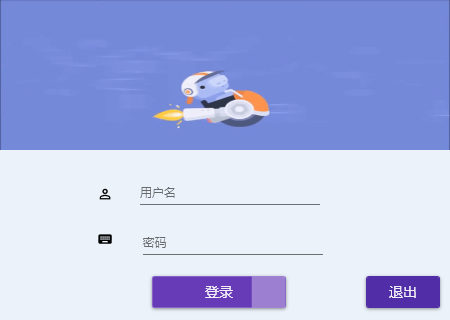

### 登录至主界面
- 输入密码后点击登录，至主界面，如下所示的聊天列表

    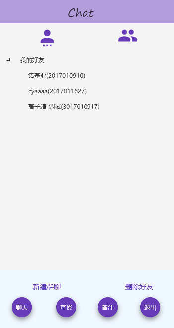

#### 查找好友
- 点击查找好友，弹出如下的对话框，输入相应的学号进行查找：

    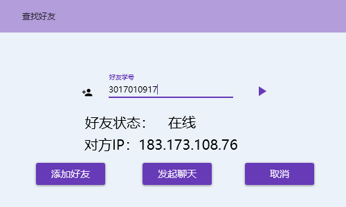

#### 备注好友
- 选中好友后点击`备注`，则输入想要的备注，按下回车键。

    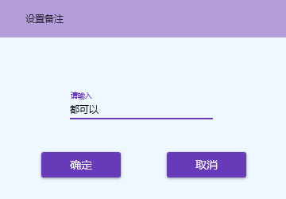
#### 删除好友
- 选中好友后直接删除即可
#### 创建群聊
- 点击`创建群聊`，输入相应的群聊ID。
### 发起聊天
- 选中好友后，点击聊天，进入到以下的聊天界面
- 聊天界面进入后，自动加载之前的聊天记录。
- 输入信息点击发送，则利用TCP进行发送。
- 点击UDP发送，则利用UDP进行发送。

    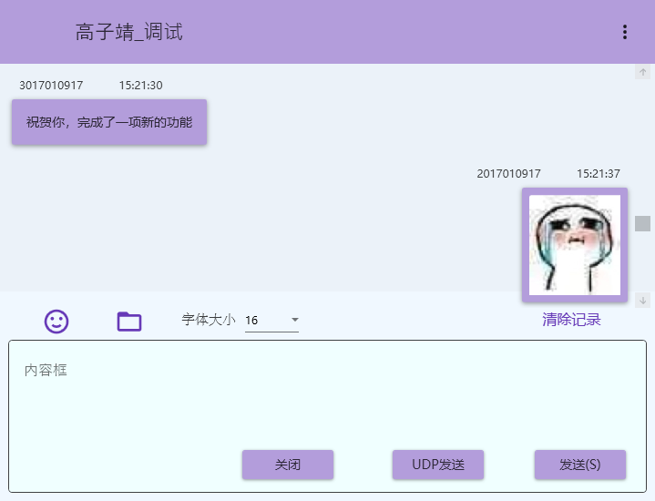
- 点击`文件夹`图标，则从本地选择文件，进行传输。发送后在聊天界面会有发送成功的消息提示。

    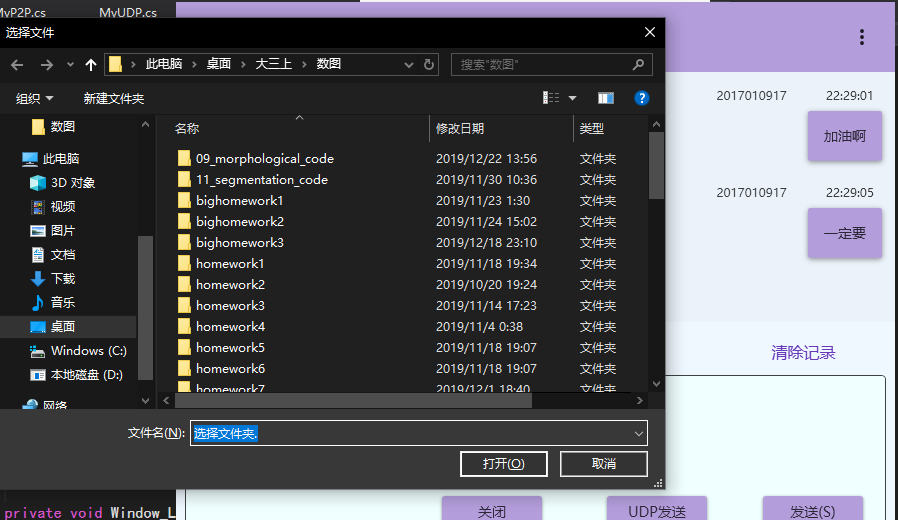
- 接收文件则会收到相应的提醒，会询问是否保存至本地，如果选择是，进一步选择保存路径即可。

    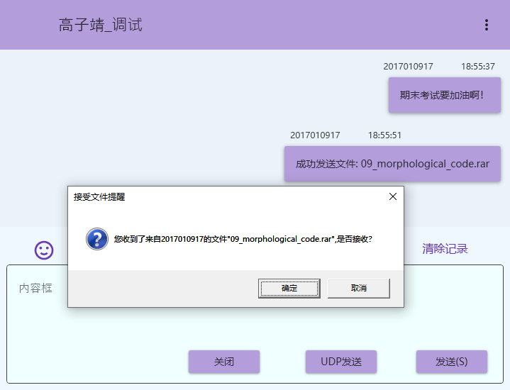
- 点击`表情`按键，便可从本地选择图片进行传送，显示在UI上为表情包

    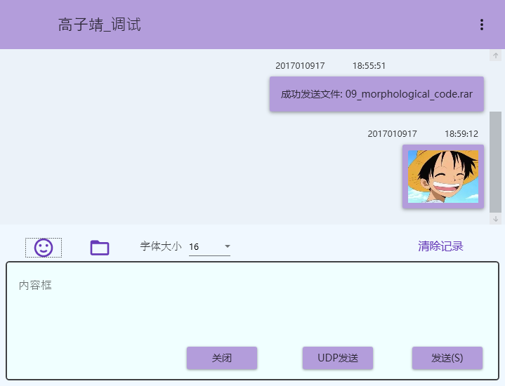
- 点击`清除记录`，便可在当前界面以及本地文件中清空聊天记录
- 点击`字体大小`右侧的选择框，可以设置输入框的字号大小。

- 下面示例一组双人聊天，分别是学号`3017010917`与`2017010917`的聊天界面。

    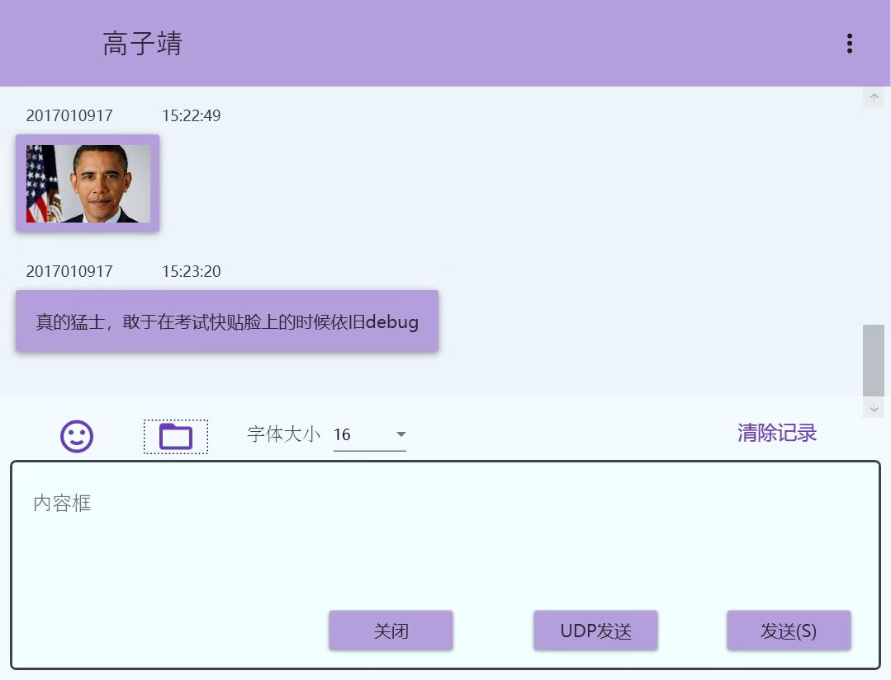
    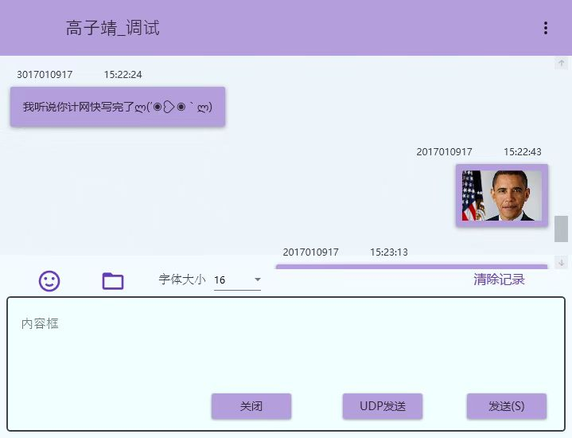

### 发起群聊
- 首先点击创建群聊即可发起群聊，在进入群聊后，在学号的输入框输入学号，进一步点击右上角的加号，将此位同学拉入群中。在点击加号之前，一定要输入学号，这样才可以加入新的群组成员。

     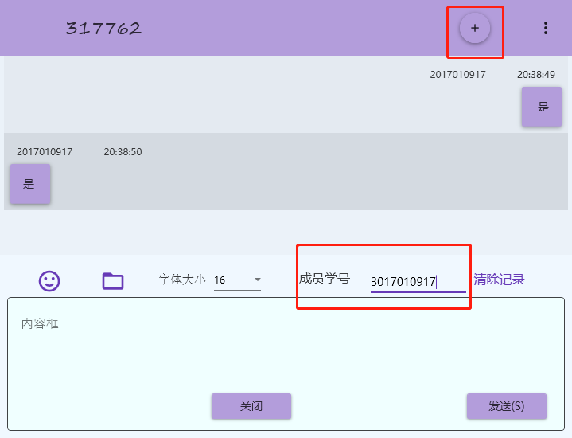
- 点击右上角的扩展，可以查看群员信息

    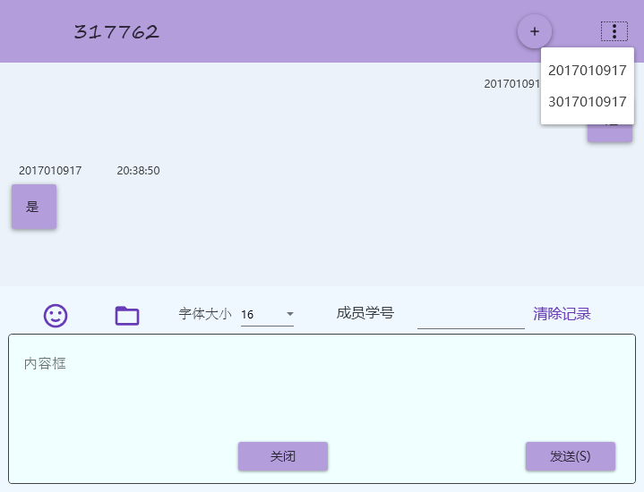

- 在群聊中点击发送，即可将消息发送给每位群成员，同时也能接受多名成员的消息，三人聊天如下：

     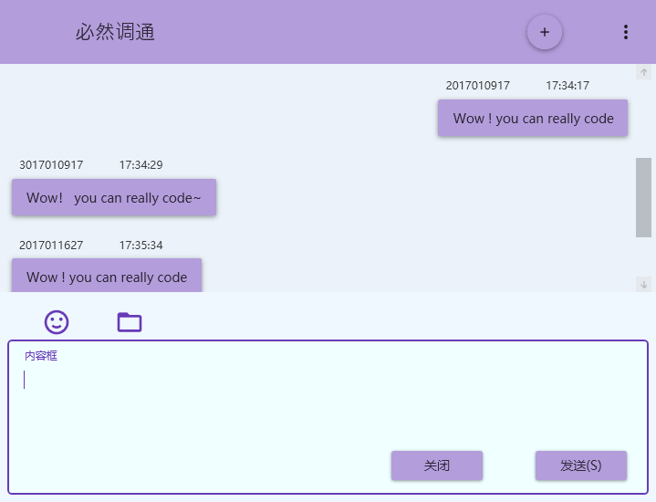

- 注： 此时不能够发送表情与文件，点击后无效果。

### 被邀请至群聊
- 由于对方发来消息，则在自己的好友列表中，重新点击一次群聊的图标，便可以看到更新以后的群聊列表，是由他人发来的消息进行动态更新。

### 退出程序
- 点击聊天列表界面的退出按键，程序退出，且从服务器下线。
